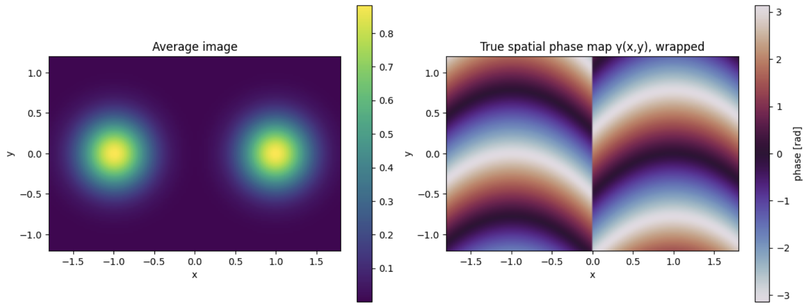
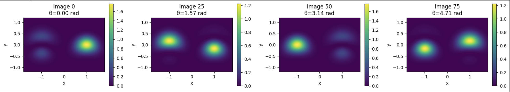
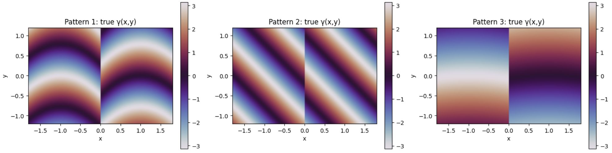
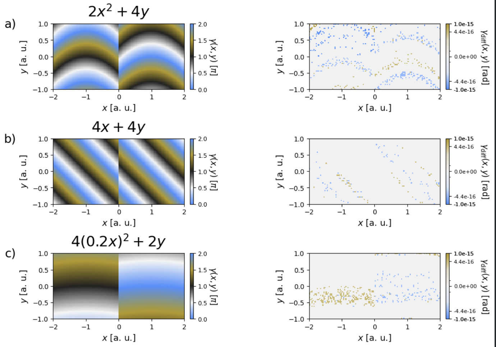
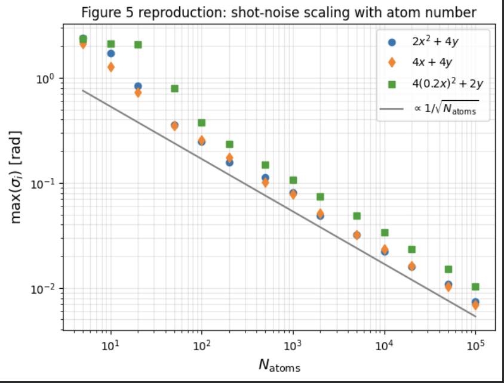
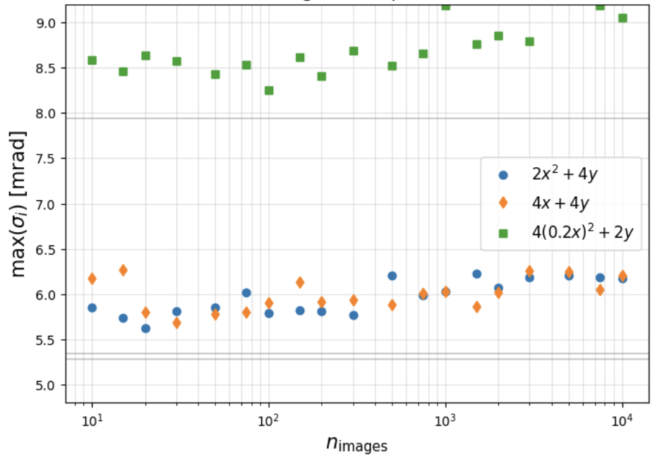
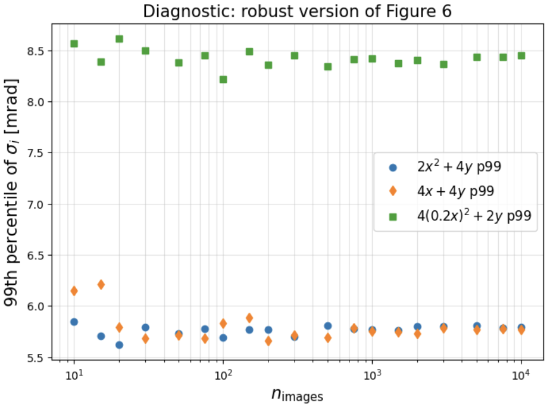
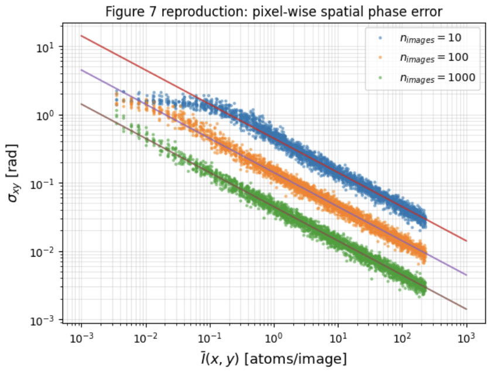

# PSPR — Spatially Resolved Phase Reconstruction (Synthetic Reproduction)

A synthetic-data reproduction of the method in:

> **Spatially resolved phase reconstruction for atom interferometry**
> Seckmeyer et al., *EPJ Quantum Technology* **12**, 34 (2025).

This repository reproduces **only the synthetic-data workflow**, not the experimental
part — the real atom-gravimeter image datasets are not publicly released with the paper.
Here, artificial two-port atom-interferometer images are generated from the paper's
image model, a PCA-based spatial phase reconstruction is applied, and the effect of atom
shot noise on the recovered phase is tested.

---

## Contents

- [Goal](#goal)
- [Installation](#installation)
- [How to run](#how-to-run)
- [Method overview](#method-overview)
- [Step 1 — Synthetic data generation](#step-1--synthetic-data-generation)
- [Step 2 — Noise-free reconstruction](#step-2--noise-free-reconstruction)
- [Step 3 — Shot-noise simulation](#step-3--shot-noise-simulation)
- [Summary of results](#summary-of-results)
- [Limitations](#limitations)
- [License](#license)

---

## Goal

An atom interferometer usually measures a single global phase. But the atom-cloud images
also carry phase information that varies *across* the cloud. PSPR (spatially resolved
phase reconstruction) recovers the spatial phase map $\gamma(x,y)$ from a stack of
interferometer images.

In this synthetic reproduction the true $\gamma(x,y)$ is known in advance, so we can
check whether the PCA pipeline recovers the input phase map correctly.

---

## Installation

```bash
pip install -r requirements.txt
```

Required packages: `numpy`, `scipy`, `matplotlib`, `scikit-learn`, `scikit-image`.

## How to run

Open `pspr_synthetic_reproduction.ipynb` in Google Colab or Jupyter and run all cells.
The notebook generates the synthetic images, runs the reconstruction, adds atom shot
noise, and produces the figures below.

> **Figure paths.** The image links below assume the PNG files sit next to this README.
> If you keep them in a `figures/` folder, change e.g.
> `step1_mean_image_true_phase.png` to `figures/step1_mean_image_true_phase.png`.

---

## Method overview

The synthetic image stack is built from the interferometer image model

$$I_i(x,y) = A(x,y) + B(x,y)\cos(\theta_i + \gamma(x,y))$$

| Symbol | Meaning |
|---|---|
| $I_i(x,y)$ | intensity at pixel $(x,y)$ in image $i$ |
| $A(x,y)$ | mean background (density envelope) |
| $B(x,y)$ | local fringe amplitude |
| $\theta_i$ | global interferometer phase of image $i$ |
| $\gamma(x,y)$ | spatial phase map to reconstruct |

**Why PCA works.** A single trigonometric identity,

$$\cos(\theta_i + \gamma) = \cos\theta_i\,\cos\gamma - \sin\theta_i\,\sin\gamma,$$

turns the mean-subtracted image into

$$I_i(x,y) - A(x,y) = B\cos\gamma\,\cos\theta_i \;-\; B\sin\gamma\,\sin\theta_i .$$

This is a sum of **two fixed spatial patterns** — $B\cos\gamma$ and $B\sin\gamma$ — each
multiplied by one shot-to-shot coefficient, $\cos\theta_i$ and $\sin\theta_i$. So after
mean subtraction the ideal image stack is essentially two-dimensional, and PCA with two
components recovers exactly these two fringe modes.

**Pipeline**

```
synthetic image stack
  → subtract the mean image
  → PCA with two components
  → ellipse correction of the PCA scores
  → arctan2 phase extraction
  → reconstructed global phases θᵢ  and spatial phase map γ(x,y)
```

---

## Step 1 — Synthetic data generation

Images are generated from

$$I_i(x,y) = A(x,y) + B(x,y)\cos(\theta_i + \gamma(x,y)).$$

The global phase $\theta_i$ changes from image to image (the interferometer phase scan);
the spatial phase $\gamma(x,y)$ varies across the image and is what the algorithm must
reconstruct.

Three spatial phase patterns are tested:

$$\gamma_1(x,y) = 2x^2 + 4y$$

$$\gamma_2(x,y) = 4x + 4y$$

$$\gamma_3(x,y) = 4(0.2x)^2 + 2y$$

The images are **two-port** interferometer images: the two output ports are modelled as
two separated atom clouds with a relative phase shift of $\pi$, so they are
complementary — when one port is bright, the other is dark.

**Outputs**

Mean image and true phase:



Theta-scan images:



The three tested phase patterns:



---

## Step 2 — Noise-free reconstruction

Each image is flattened into a vector, so a stack becomes a data matrix of shape
$N_\text{images} \times N_\text{pixels}$. After subtracting the mean image, PCA extracts
the two dominant components.

**PCA scores and ellipse correction.** For each image, PCA returns two coefficients
$w_{i,1}$ and $w_{i,2}$. As the global phase is scanned these should trace a circle, but
PCA can rotate and rescale the recovered components, so in practice they trace an
**ellipse**. The ellipse correction maps the scores back onto a circle.

After correction, the global phase of each image is

$$\theta_i^{\text{rec}} = \mathrm{atan2}(w_{i,2},\, w_{i,1}),$$

and the spatial phase map is reconstructed from the corrected components $P_1(x,y)$ and
$P_2(x,y)$ as

$$\gamma^{\text{rec}}(x,y) = \mathrm{atan2}(P_2(x,y),\, P_1(x,y)).$$

Because the input is noise-free, the reconstruction matches the truth to numerical
precision — typically $10^{-15}$ to $10^{-16}$ rad.

**Output**



---

## Step 3 — Shot-noise simulation

Atom shot noise is added by treating the noise-free intensity as a probability
distribution and sampling a fixed number of atoms into the pixels. This turns a smooth
image into a noisy atom-count image, which is then passed through the same pipeline
(PCA → ellipse correction → arctan2).

For $N_\text{atoms}$ total atoms, the relative shot noise scales as
$1/\sqrt{N_\text{atoms}}$ — more atoms give a more accurate reconstruction.

**Atom-number scaling (Figure 5 style).** Varying the number of atoms per image, the
image-phase uncertainty $\sigma_i$ is expected to follow

$$\max(\sigma_i) \propto \frac{1}{\sqrt{N_\text{atoms}}}.$$



**Image-number scaling (Figure 6 style).** Varying the number of images, the global
image-phase error becomes almost independent of the image count once enough images are
used — beyond that point, adding more images does not strongly improve the global phase
if the shot noise per image is fixed.





**Pixel-wise phase error (Figure 7 style).** Analysing the spatial phase error pixel by
pixel, the expected scaling is

$$\sigma_{xy} \propto \frac{1}{\sqrt{n_\text{images}\,\bar{I}(x,y)}},$$

where $\bar{I}(x,y)$ is the average atom count at pixel $(x,y)$. Pixels with more atoms
have a lower phase error; using more images reduces it further.



---

## Summary of results

1. Synthetic two-port atom-interferometer images are generated from a known spatial phase map.
2. PCA extracts the two dominant fringe modes from the image stack.
3. Ellipse correction removes PCA's arbitrary rotation and scaling.
4. Global image phases are recovered as $\theta_i^{\text{rec}} = \mathrm{atan2}(w_{i,2}, w_{i,1})$.
5. The spatial phase map is recovered as $\gamma^{\text{rec}}(x,y) = \mathrm{atan2}(P_2, P_1)$.
6. In the noise-free case the reconstruction matches the input to numerical precision.
7. With shot noise, the image-phase error follows $\max(\sigma_i) \propto 1/\sqrt{N_\text{atoms}}$.
8. The pixel-wise error follows $\sigma_{xy} \propto 1/\sqrt{n_\text{images}\,\bar{I}(x,y)}$.

---

## Limitations

This repository reproduces only the synthetic-data part of the paper. The experimental
atom-gravimeter image datasets are not included because they are not publicly available
with the paper (the authors provide them on reasonable request). The Monte-Carlo curves
may differ slightly from the paper, which used many more simulation runs; here the run
counts are kept small so everything runs on a normal laptop or in Google Colab.

---

## License

For educational and research-reproduction purposes.
